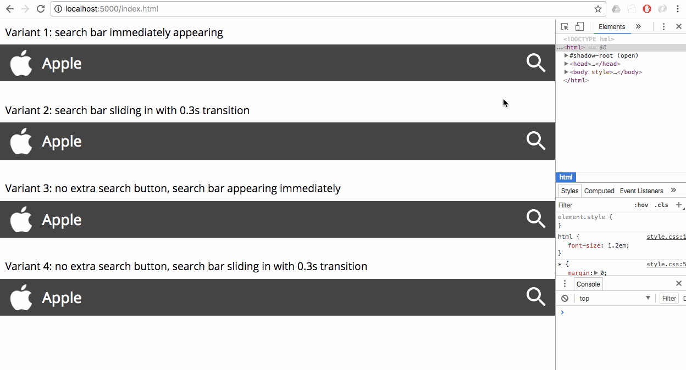

# Expanding Search Bar

Implementation of an expanding/collapsing search bar in a website header.

This kind of search bar can be useful in situations where there is **limited horizontal space**, so that permanently displaying a search bar of a sufficient width is not an option (for example, on mobile phones, or if the header is already packed with other content).

## Live Demo

[Click here](https://weibeld.github.io/webdesign-expanding-search-bar/)

## Recorded Demo

## Summary

There are four slightly different expanding search bars in this repository. In each variant, the search bar appears on a click on the button at the right edge of the header. The newly appeared content "hovers" over the header, that is, it hides everything below it.

When the search bar is expanded, a search query can be entered and submitted by clicking on the button showing a search icon. The query can also be submitted by hitting *Enter* on the keyboard.

The search bar can be collapsed by clicking anywhere on the page.

The four variants differ in the structure of the search bar that appears, and in the way it appears:

- **Variant 1:** a search form, including a text box and submit button, appears immediately
- **Variant 2:** a search form, including a text box and submit button, slides in gradually
- **Variant 3:** a text box appears immediately 
- **Variant 4:** a text box slides in gradually

### Responsiveness

In the current implementation, the search bar, when it is expanded, hides all of the header except the logo at the left edge of the header, if the viewport width is more than 400px. If the viewport width is 400px or less (typically the case on mobile phones with portrait orientation), the search bar hides the entire header including the logo. This is to allow sufficient space to enter a search query on all screen sizes.

A typical scenario in which this expandable search bar can be used is to display a permanent search bar on large screens, and to resort to an expandable search bar (as implemented here) on smaller screens.

### Files

The files `index.html` and `style.css` contain the HTML and CSS code of all the four variants sequentially. The JavaScript of the four variants is contained in the separate four files `js/script-1.js` to `js/script-4-js`. 

### Design

The search bar is implemented with HTML, CSS, and JavaScript. Below is the role that each of these technologies plays in the design.

#### HTML

All components are normal HTML elements. The dynamic "search content" is either a `<form>` element (Variant 1 + 2), or a bare `<input type="text">` element (Variant 3 + 4).

In Variants 1 + 2, the button to toggle the search bar is a normal `<button>` outside of the search form.

In Variants 3 + 4, the button to toggle the search bar is at the same time the submit button of the search form, and it is thus part of the search form. How it is determined which of these two functions to perform when the button is clicked is described in the [JavaScript](#javascript) section.

#### CSS

The search bar is positioned relative to the header by using `position: absolute`. This has the desired effect that the search bar (when it is displayed) hides part of the header. 

The search bar is hidden by default. This is achieved by using `display: none` (Variant 1 + 3), or by positioning it outside the viewport, by setting the `right` property to an appropriate negative value (Variant 2 + 4). In the latter case, it is needed to set `overflow: hidden` in the header, so that the content outside the viewport is really hidden and does not provoke horizontal scrolling.

In order to display the search bar, the special class `"active"` is added to it (the adding and removing of classes is the main function of the [JavaScript](#javascript) part of the implementation). In the `"active"`version, the search bar becomes visible. This is done either by removing the previously set `display: none` (Variant 1 + 3), or by positioning the search bar at the desired position *inside* the viewport (by setting the `right` property to an appropriate positive value), and applying a [CSS transition](https://www.w3schools.com/css/css3_transitions.asp) between the previous (invisible) position and the new (visible) position. The CSS transition used in this case is `transition: right 0.3s`, which causes the "sliding in from the right" effect. 

#### JavaScript

The JavaScript for each of the four variants is contained in a separate file named `script-X.js`.

As mentioned, the main function of the JavaScript is to add and remove the `"active"` class to and from the search bar. This has to be done upon a click on the button for toggling the search bar. To this end, a click event listener is added to this button. 

To be clear, when the `"active"` class is added to the search bar, the search bar *appears*, and when the `"active"` class is removed from the search bar, the search bar *disappears.* (as defined in the search bar `"active"` rule in the CSS).

To add and remove classes from elements, the useful [Classie.js](https://www.w3schools.com/css/css3_transitions.asp) library is used.

The search bar is also collapsed when the user clicks anywhere on the page (except on the search bar itself). To this end, a click event listener is also added to the entire page.

In Variant 1 + 2, the button to toggle the search bar (`#search-toggle-X`) is independent from the search form. When it's clicked, the `"active"` class is added to the search bar, as well as to the button itself. When the button is clicked again in the `"active"` state, then the `"active"` class is removed from the search bar and the button itself. This causes the button to toggle the visibility of the search bar.

In Variant 3 + 4, the button to toggle the search bar (`#search-submit-X`) is at the same time the submit button of the search form. So, this button has two functions, first, expanding the search bar, and, second, submitting the search query. To prevent the automatic submission of the form when this button is clicked, we add `onsubmit="return isSubmitForm()"` in the HTML. The `isSubmitForm()` function returns "true" if the form needs indeed to be submitted, and "false" if the button has been clicked merely to expand the search bar, and not to submit a query. "True" is returned if there is some text in the search bar. This means that the search bar is open, and the user entered a search term. "False" is returned if the search bar is empty, which can either be the case when it is closed, or when it is open, but no text has been entered so far. In this case the submit button serves as a mere toggle to open and close the search bar.

Some other minor functions performed by the JavaScript are:

- Changing the image of the search bar toggle button in Variant 1 + 2
- Focussing the text box in the search bar, as soon as it is visible
- Removing the text in the text box when the search bar is collapsed in Variant 3 + 4

## Contributing

Tests of these implementations with various platforms and web browsers are welcome! If you encounter incompatibilities or have suggestions, please create an [issue](https://github.com/weibeld/webdesign-expanding-search-bar/issues) or [pull request](https://github.com/weibeld/webdesign-expanding-search-bar/pulls).

## References

- The present implementation is inspired from this blog post
    - <http://callmenick.com/post/expanding-search-bar-using-css-transitions>
- Classie.js
    - <http://callmenick.com/post/add-remove-and-check-classes>

